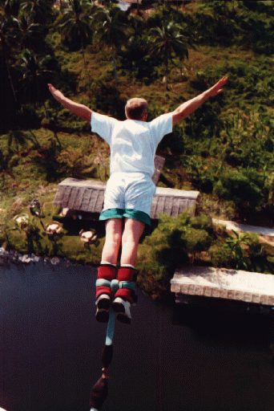
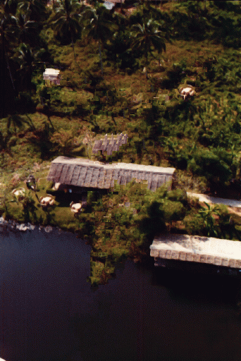
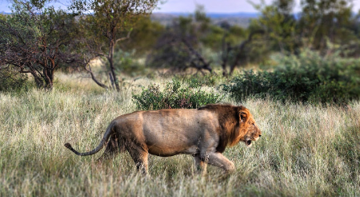
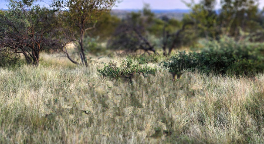

# 🖼️ Exemplar-Based Image Inpainting

This project implements the **exemplar-based inpainting algorithm** as described in the paper *"Region Filling and Object Removal by Exemplar-Based Image Inpainting"* (Criminisi, Pérez, Toyama – IEEE Transactions on Image Processing, 2004). The goal is to remove unwanted objects or fill missing regions in an image by copying similar patches from the remaining content.

---

## 📌 Highlights

- 🔍 Patch-based inpainting using local similarity
- 🧠 Priority-driven filling with confidence and data terms
- 🌀 Adaptive patch search zones for better results and faster execution
- 🌄 Support for both grayscale and color natural images

---

## 🧪 Method Overview

The algorithm works by iteratively filling the missing region (target) using the most similar patch from the known region (source). The order of filling is controlled by a **priority term** defined as:

`P(p) = C(p) · D(p)`

Where:
- `C(p)` is the **confidence term**: favors concentric filling from known pixels.
- `D(p)` is the **data term**: encourages propagation of linear structures like edges.

The best matching patch is chosen using **Sum of Squared Differences (SSD)**, excluding unknown pixels from the comparison.

Patch size, search zone radius, and the presence of data/confidence terms can be tuned for optimal results.

---

## 💡 Improvements

To improve performance:
- The patch search is limited to a window around the target region.
- Several versions were tested with and without the data term `D(p)` to assess its visual impact.
- Multi-resolution strategies and a prototype of **PatchMatch** were explored as faster alternatives.

---

## 🎨 Results

Below are visual examples of the inpainting process. On the left: original image with masked area. On the right: restored image.

### 🪂 Example 1 — Bungee Jumping Scene

| Original | Inpainted |
|----------|-----------|
|  |  |

---

### 🌴 Example 2 — Island with Palm Trees

| Original | Inpainted |
|----------|-----------|
|  |  |

---

### 🦁 Example 3 — Lion in the Wild

| Original | Inpainted |
|----------|-----------|
|  |  |

---
